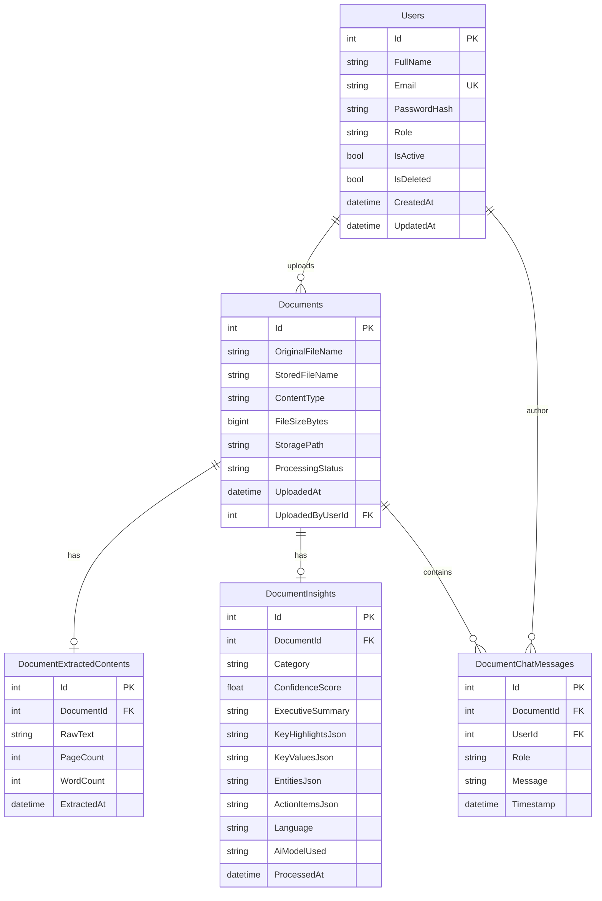

# AI Document Intelligence Platform — System Architecture

## 1. Overview
The **AI Document Intelligence Platform** is an enterprise-grade document processing, information extraction, and conversational semantic Q&A solution built with **ASP.NET Core 8 Web API**, **Entity Framework Core (SQL Server)**, and a modern **React + Vite + TypeScript** frontend.

---

## 2. High-Level Architecture

```mermaid
flowchart TD
    subgraph ClientLayer ["Frontend Layer (React 18 + Vite + Tailwind CSS)"]
        UI_Auth[Authentication & Session]
        UI_Dash[Dashboard & Metrics Telemetry]
        UI_Upload[Multi-Format Drag & Drop Ingestion]
        UI_Studio[Document Intelligence Studio]
        UI_Chat[Interactive Grounded Q&A Assistant]
        UI_Admin[User & Access Management]
    end

    subgraph ApiLayer ["Backend API Layer (ASP.NET Core 8 Web API)"]
        AuthController[UsersController - Auth & CRUD]
        DocsController[DocumentsController - Upload / Download / Reprocess]
        ChatController[DocumentChatController - Conversational Q&A]
        DashController[DashboardController - Aggregate Metrics]
        ExceptionMiddleware[RFC 7807 ProblemDetails Exception Middleware]
    end

    subgraph ProcessingPipeline ["Asynchronous Processing Engine"]
        Queue[Bounded Channel Document Queue]
        Worker[DocumentProcessingWorker (BackgroundService)]
        Extractor[TextExtractorService (PdfPig, OpenXML, OCR)]
        AiEngine[AiIntelligenceService (Gemini / OpenAI / Heuristic NLP)]
    end

    subgraph PersistenceLayer ["Storage & Database"]
        SqlDb[(SQL Server - EF Core)]
        DiskStorage[Physical Encrypted File Storage]
    end

    ClientLayer -->|REST API + JWT Bearer| ApiLayer
    ApiLayer -->|Transactions| SqlDb
    ApiLayer -->|Persist File| DiskStorage
    ApiLayer -->|Enqueue Doc ID| Queue
    Queue -->|Dequeue & Process| Worker
    Worker -->|Extract Content| Extractor
    Worker -->|Classify & Summarize| AiEngine
    Worker -->|Save Insights & Status| SqlDb
```

---

## 3. Core Subsystems

### 3.1 Document Ingestion & Storage
- Supported formats: **PDF, DOCX, XLSX, TXT, CSV, JSON, PNG, JPG**.
- Validation: MIME types, extension whitelist, and file size quotas (default 15 MB).
- Storage: Unique GUID-named physical file storage on disk with metadata persisted in SQL Server.

### 3.2 Asynchronous Document Processing Pipeline
1. **Queueing**: Upon upload, the document is tagged `Queued` and its ID is published to an in-memory `Channel<int>` queue.
2. **Text & Table Extraction**:
   - `PdfPig` extracts page-by-page PDF text streams.
   - `DocumentFormat.OpenXml` extracts hierarchical paragraphs from Word (.docx) and sheet cell matrices from Excel (.xlsx).
   - Plaintext / structured files are decoded into UTF-8.
3. **AI Intelligence & Information Extraction**:
   - **Classification**: Detects document type (Invoice, Legal Contract, Resume, Financial Report, Technical Spec, ID, General).
   - **Key-Value & Entity Extraction**: Identifies monetary amounts, dates, invoice numbers, contracting parties, candidate names, contact emails, and phone numbers.
   - **Executive Summarization**: Generates high-level executive summaries and highlights.
   - **Action Item Recommendations**: Suggests domain-specific follow-ups (e.g. review payment due dates, signature verification).
4. **Resilience & Hybrid AI Engine**:
   - Primary: Google Gemini (`gemini-1.5-flash`) or OpenAI (`gpt-4o-mini`).
   - Built-in Heuristic & NLP Fallback: Fully functional offline even when no external API key is provided.

### 3.3 Interactive Conversational Document Q&A
- Multi-turn conversational memory per document.
- Answers are strictly grounded in the document context.
- Full chat audit history stored in `DocumentChatMessages`.

---

## 4. Database Schema



